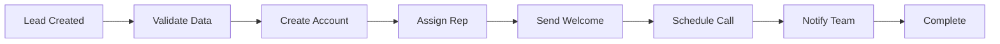
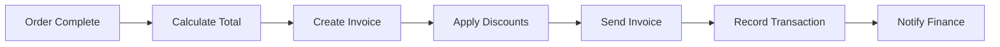
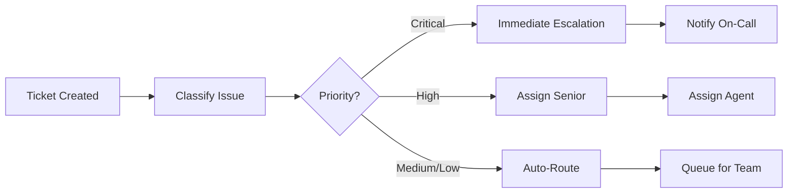
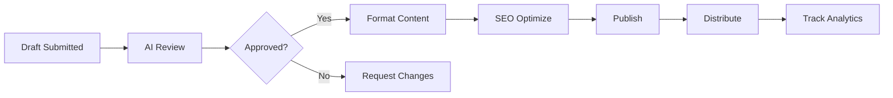
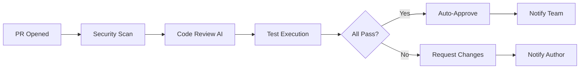

# PRD-003: Business Automation

**PRD Version:** 1.0.0  
**Created:** 2025-11-27  
**Owner:** Business Team  
**Status:** Active  
**Phase:** 3 of 5  
**Timeline:** Weeks 9-12

---

## 1. Overview

### 1.1 Purpose

This Product Requirements Document defines the specifications for FlashFusion's Business Automation capabilities - the workflow engine and integration layer that enables automated business processes powered by AI agents.

### 1.2 Background

With the Core Platform (Phase 1) and Agent Infrastructure (Phase 2) established, Phase 3 focuses on leveraging these foundations to automate real business workflows. This phase transforms FlashFusion from a technical platform into a value-generating business operating system.

### 1.3 Goals

1. **Workflow Engine:** Declarative, checkpoint-enabled workflow execution
2. **Business Workflows:** 5+ automated end-to-end business processes
3. **Third-Party Integrations:** Stripe, GitHub, Notion, Slack connections
4. **Event-Driven Automation:** Real-time triggers and webhooks
5. **Measurable ROI:** 50% reduction in manual process time

### 1.4 Non-Goals (Out of Scope for Phase 3)

- Analytics dashboards (Phase 4)
- Predictive models (Phase 4)
- Production scaling (Phase 5)
- Customer-facing interfaces (Phase 5)

---

## 2. Requirements

### 2.1 Functional Requirements

#### FR-001: Workflow Engine

**Priority:** P0 (Critical)  
**Status:** ○ Planned

| ID | Requirement | Acceptance Criteria |
|----|-------------|---------------------|
| FR-001.1 | Declarative workflow definition | YAML/JSON workflow schema |
| FR-001.2 | Step execution | Sequential and parallel step support |
| FR-001.3 | Checkpointing | Resume from last successful step |
| FR-001.4 | Error handling | Retry policies, fallback handlers |
| FR-001.5 | Human escalation | Pause workflow for human approval |
| FR-001.6 | Workflow versioning | Multiple versions, safe upgrades |

#### FR-002: Core Business Workflows

**Priority:** P0 (Critical)  
**Status:** ○ Planned

| ID | Workflow | Description |
|----|----------|-------------|
| FR-002.1 | Customer Onboarding | Lead → Account → Welcome → Assignment |
| FR-002.2 | Sales Pipeline | Opportunity → Proposal → Contract → Close |
| FR-002.3 | Invoice Generation | Order → Invoice → Payment → Receipt |
| FR-002.4 | Support Triage | Ticket → Classify → Route → Resolve |
| FR-002.5 | Content Publishing | Draft → Review → Publish → Distribute |

#### FR-003: Third-Party Integrations (MCP Servers)

**Priority:** P0 (Critical)  
**Status:** ○ Planned

| ID | Integration | Purpose | MCP Server |
|----|-------------|---------|------------|
| FR-003.1 | Stripe | Payments, invoicing | stripe-mcp |
| FR-003.2 | GitHub | Code, issues, PRs | github-mcp |
| FR-003.3 | Notion | Documents, wikis | notion-mcp |
| FR-003.4 | Slack | Notifications, approvals | slack-mcp |
| FR-003.5 | SendGrid | Email automation | sendgrid-mcp |
| FR-003.6 | Calendly | Scheduling | calendly-mcp |

#### FR-004: Event-Driven Automation

**Priority:** P1 (High)  
**Status:** ○ Planned

| ID | Requirement | Acceptance Criteria |
|----|-------------|---------------------|
| FR-004.1 | Webhook receiver | HTTP endpoint for external events |
| FR-004.2 | Event routing | Route events to workflows by type |
| FR-004.3 | Event Bus (Redis PubSub) | Internal event distribution |
| FR-004.4 | Scheduled triggers | Cron-based workflow execution |
| FR-004.5 | Event filtering | Conditional event processing |

#### FR-005: Workflow Monitoring

**Priority:** P1 (High)  
**Status:** ○ Planned

| ID | Requirement | Acceptance Criteria |
|----|-------------|---------------------|
| FR-005.1 | Execution dashboard | List all workflow executions |
| FR-005.2 | Step-by-step view | Visualize workflow progress |
| FR-005.3 | Error inspection | Detailed error logs per step |
| FR-005.4 | Alerting | Notify on failures, SLA breaches |
| FR-005.5 | Metrics | Completion rate, duration, errors |

### 2.2 Non-Functional Requirements

#### NFR-001: Performance

| ID | Requirement | Target | Measurement |
|----|-------------|--------|-------------|
| NFR-001.1 | Workflow start latency | <500ms | Time to first step |
| NFR-001.2 | Step execution overhead | <100ms | Engine overhead per step |
| NFR-001.3 | Event processing latency | <200ms | Webhook to step trigger |
| NFR-001.4 | Concurrent workflows | 100+ | Simultaneous executions |

#### NFR-002: Reliability

| ID | Requirement | Target | Measurement |
|----|-------------|--------|-------------|
| NFR-002.1 | Workflow completion rate | >95% | Successful completions |
| NFR-002.2 | Checkpoint recovery | 100% | Resume from checkpoint |
| NFR-002.3 | Zero data loss | 100% | Workflow state persistence |
| NFR-002.4 | Event delivery | At-least-once | No dropped events |

#### NFR-003: Availability

| ID | Requirement | Target | Measurement |
|----|-------------|--------|-------------|
| NFR-003.1 | Workflow engine uptime | 99.9% | Health check success |
| NFR-003.2 | Integration uptime | 99.5% | MCP server availability |
| NFR-003.3 | Event bus uptime | 99.9% | Redis availability |

---

## 3. Technical Design

### 3.1 Architecture Diagram

```
┌─────────────────────────────────────────────────────────────────────────────┐
│                           TRIGGER LAYER                                     │
├─────────────────────────────────────────────────────────────────────────────┤
│                                                                             │
│  ┌──────────────┐  ┌──────────────┐  ┌──────────────┐  ┌──────────────┐   │
│  │   Webhooks   │  │   Schedules  │  │  Event Bus   │  │  Manual API  │   │
│  │  (HTTP POST) │  │   (Cron)     │  │ (Redis Sub)  │  │  (REST)      │   │
│  └──────┬───────┘  └──────┬───────┘  └──────┬───────┘  └──────┬───────┘   │
│         │                 │                 │                 │           │
│         └─────────────────┴─────────────────┴─────────────────┘           │
│                                    │                                       │
└────────────────────────────────────┼───────────────────────────────────────┘
                                     ▼
┌─────────────────────────────────────────────────────────────────────────────┐
│                         WORKFLOW ENGINE                                     │
├─────────────────────────────────────────────────────────────────────────────┤
│                                                                             │
│  ┌──────────────────┐     ┌──────────────────┐     ┌──────────────────┐   │
│  │  Workflow        │────►│  Step Executor   │────►│  Checkpoint      │   │
│  │  Orchestrator    │     │  (LangGraph)     │     │  Manager         │   │
│  └────────┬─────────┘     └────────┬─────────┘     └──────────────────┘   │
│           │                        │                                       │
│           ▼                        ▼                                       │
│  ┌──────────────────┐     ┌──────────────────┐                            │
│  │  Error Handler   │     │  Human Escalator │                            │
│  │  (Retry/Fallback)│     │  (Approvals)     │                            │
│  └──────────────────┘     └──────────────────┘                            │
│                                                                             │
└─────────────────────────────────────────────────────────────────────────────┘
                                     │
                                     ▼
┌─────────────────────────────────────────────────────────────────────────────┐
│                         AGENT LAYER                                         │
├─────────────────────────────────────────────────────────────────────────────┤
│                                                                             │
│  ┌─────────────┐  ┌─────────────┐  ┌─────────────┐  ┌─────────────┐       │
│  │ Orchestrator│  │  Financial  │  │   Support   │  │   Content   │       │
│  │   Agent     │  │   Agent     │  │   Agent     │  │   Agent     │       │
│  └──────┬──────┘  └──────┬──────┘  └──────┬──────┘  └──────┬──────┘       │
│         │                │                │                │              │
└─────────┼────────────────┼────────────────┼────────────────┼──────────────┘
          │                │                │                │
          ▼                ▼                ▼                ▼
┌─────────────────────────────────────────────────────────────────────────────┐
│                         INTEGRATION LAYER (MCP)                             │
├─────────────────────────────────────────────────────────────────────────────┤
│                                                                             │
│  ┌─────────┐  ┌─────────┐  ┌─────────┐  ┌─────────┐  ┌─────────┐         │
│  │ Stripe  │  │ GitHub  │  │ Notion  │  │ Slack   │  │SendGrid │         │
│  │  MCP    │  │  MCP    │  │  MCP    │  │  MCP    │  │  MCP    │         │
│  └─────────┘  └─────────┘  └─────────┘  └─────────┘  └─────────┘         │
│                                                                             │
└─────────────────────────────────────────────────────────────────────────────┘
```

### 3.2 Workflow Definition Schema

```yaml
# workflows/customer-onboarding.yaml
apiVersion: flashfusion.co/v1
kind: Workflow
metadata:
  name: customer-onboarding
  version: "1.0.0"
  description: "Complete customer onboarding from lead to active user"
  owner: business-team
  tags: [onboarding, customer, critical]

spec:
  triggers:
    - type: webhook
      endpoint: /webhooks/crm/new-lead
      filter:
        source: hubspot
    - type: event
      topic: crm.lead.created
    - type: manual
      permissions: [sales-team, admin]

  inputs:
    lead:
      type: object
      required: true
      properties:
        email: { type: string, format: email }
        name: { type: string }
        company: { type: string }
        source: { type: string }

  variables:
    customer_id: null
    sales_rep: null
    onboarding_status: "pending"

  steps:
    - id: validate-lead
      name: "Validate Lead Data"
      agent: orchestrator
      action: validate
      input:
        data: "{{ inputs.lead }}"
        schema: lead-schema
      output: validation_result
      timeout: 30s
      retries: 0

    - id: create-customer
      name: "Create Customer Record"
      agent: orchestrator
      action: call-mcp
      input:
        server: database-mcp
        tool: customer.create
        params:
          email: "{{ inputs.lead.email }}"
          name: "{{ inputs.lead.name }}"
          company: "{{ inputs.lead.company }}"
      output: customer_id
      condition: "{{ validation_result.valid == true }}"
      timeout: 60s
      retries: 2

    - id: assign-sales-rep
      name: "Assign Sales Representative"
      agent: orchestrator
      action: call-agent
      input:
        agent: sales-agent
        action: assign-rep
        data:
          customer_id: "{{ customer_id }}"
          territory: "{{ inputs.lead.company_region }}"
      output: sales_rep
      timeout: 30s

    - id: send-welcome-email
      name: "Send Welcome Email"
      agent: orchestrator
      action: call-mcp
      input:
        server: sendgrid-mcp
        tool: email.send
        params:
          to: "{{ inputs.lead.email }}"
          template: welcome-email
          variables:
            name: "{{ inputs.lead.name }}"
            rep_name: "{{ sales_rep.name }}"
            rep_email: "{{ sales_rep.email }}"
      parallel: true  # Can run in parallel with next step

    - id: create-crm-record
      name: "Create CRM Record"
      agent: orchestrator
      action: call-mcp
      input:
        server: hubspot-mcp
        tool: contact.create
        params:
          email: "{{ inputs.lead.email }}"
          properties:
            lifecycle_stage: customer
            assigned_owner: "{{ sales_rep.hubspot_id }}"
      parallel: true  # Can run in parallel with previous step

    - id: schedule-onboarding-call
      name: "Schedule Onboarding Call"
      agent: orchestrator
      action: call-mcp
      input:
        server: calendly-mcp
        tool: event.create
        params:
          type: onboarding-call
          invitee_email: "{{ inputs.lead.email }}"
          host_email: "{{ sales_rep.email }}"
      depends_on: [send-welcome-email, create-crm-record]

    - id: notify-sales-team
      name: "Notify Sales Team"
      agent: orchestrator
      action: call-mcp
      input:
        server: slack-mcp
        tool: message.send
        params:
          channel: "#sales-notifications"
          message: "🎉 New customer onboarded: {{ inputs.lead.name }} from {{ inputs.lead.company }}"

  error_handling:
    - step: validate-lead
      on_error:
        action: fail
        message: "Lead validation failed"

    - step: create-customer
      on_error:
        action: retry
        max_retries: 3
        backoff: exponential
        
    - step: "*"
      on_error:
        action: escalate
        channel: slack
        message: "Onboarding workflow failed at step {{ error.step }}"

  human_escalation:
    - condition: "{{ validation_result.confidence < 0.8 }}"
      step: validate-lead
      channel: slack
      approvers: [sales-manager]
      timeout: 24h

  monitoring:
    metrics:
      - name: onboarding_completion_rate
        type: gauge
      - name: onboarding_duration_seconds
        type: histogram
      - name: onboarding_errors_total
        type: counter
        labels: [step, error_type]
    
    alerts:
      - name: low-completion-rate
        condition: "onboarding_completion_rate < 0.85"
        severity: warning
        channels: [slack, pagerduty]
      
      - name: high-error-rate
        condition: "rate(onboarding_errors_total[5m]) > 0.1"
        severity: critical
        channels: [slack, pagerduty]

  sla:
    completion_time: 5m
    escalation_on_breach: true
```

### 3.3 Workflow Engine Implementation

```typescript
// services/workflow-engine/src/engine.ts
import { StateGraph, Annotation, MemorySaver } from "@langchain/langgraph";
import { BaseMessage } from "@langchain/core/messages";
import { Logger, Tracer } from "@flashfusion/otel";

interface WorkflowState {
  inputs: Record<string, unknown>;
  variables: Record<string, unknown>;
  currentStep: string;
  stepResults: Record<string, unknown>;
  status: "running" | "paused" | "completed" | "failed";
  error?: Error;
}

interface WorkflowDefinition {
  metadata: WorkflowMetadata;
  spec: WorkflowSpec;
}

class WorkflowEngine {
  private readonly logger: Logger;
  private readonly tracer: Tracer;
  private readonly checkpointer: MemorySaver;
  private readonly agentRegistry: AgentRegistry;

  constructor(deps: WorkflowEngineDeps) {
    this.logger = deps.logger;
    this.tracer = deps.tracer;
    this.checkpointer = new MemorySaver();
    this.agentRegistry = deps.agentRegistry;
  }

  async executeWorkflow(
    definition: WorkflowDefinition,
    inputs: Record<string, unknown>
  ): Promise<WorkflowExecution> {
    const span = this.tracer.startSpan("executeWorkflow", {
      workflowId: definition.metadata.name,
    });

    try {
      // Build LangGraph from workflow definition
      const graph = this.buildGraph(definition);
      
      // Create initial state
      const initialState: WorkflowState = {
        inputs,
        variables: { ...definition.spec.variables },
        currentStep: definition.spec.steps[0].id,
        stepResults: {},
        status: "running",
      };

      // Execute with checkpointing
      const config = {
        configurable: { thread_id: this.generateExecutionId() },
        checkpointer: this.checkpointer,
      };

      const result = await graph.invoke(initialState, config);

      return {
        id: config.configurable.thread_id,
        workflow: definition.metadata.name,
        status: result.status,
        outputs: result.stepResults,
        duration: span.duration,
      };
    } catch (error) {
      this.logger.error("Workflow execution failed", { error, definition });
      throw error;
    } finally {
      span.end();
    }
  }

  private buildGraph(definition: WorkflowDefinition): StateGraph<WorkflowState> {
    const StateAnnotation = Annotation.Root({
      inputs: Annotation<Record<string, unknown>>(),
      variables: Annotation<Record<string, unknown>>(),
      currentStep: Annotation<string>(),
      stepResults: Annotation<Record<string, unknown>>(),
      status: Annotation<string>(),
    });

    const graph = new StateGraph(StateAnnotation);

    // Add nodes for each step
    for (const step of definition.spec.steps) {
      graph.addNode(step.id, this.createStepExecutor(step));
    }

    // Add edges based on dependencies and conditions
    for (let i = 0; i < definition.spec.steps.length - 1; i++) {
      const current = definition.spec.steps[i];
      const next = definition.spec.steps[i + 1];
      
      if (current.parallel) {
        // Parallel execution - fork then join
        graph.addEdge(current.id, next.id);
      } else if (current.depends_on) {
        // Wait for dependencies
        for (const dep of current.depends_on) {
          graph.addEdge(dep, current.id);
        }
      } else {
        // Sequential execution
        graph.addEdge(current.id, next.id);
      }
    }

    return graph.compile();
  }

  private createStepExecutor(step: WorkflowStep) {
    return async (state: WorkflowState): Promise<Partial<WorkflowState>> => {
      const span = this.tracer.startSpan(`step:${step.id}`);

      try {
        // Check condition
        if (step.condition && !this.evaluateCondition(step.condition, state)) {
          return { currentStep: this.getNextStep(step, state) };
        }

        // Resolve input templates
        const resolvedInput = this.resolveTemplates(step.input, state);

        // Execute step based on action type
        let result: unknown;
        switch (step.action) {
          case "validate":
            result = await this.executeValidation(resolvedInput);
            break;
          case "call-mcp":
            result = await this.executeMcpCall(step, resolvedInput);
            break;
          case "call-agent":
            result = await this.executeAgentCall(step, resolvedInput);
            break;
          default:
            throw new Error(`Unknown action: ${step.action}`);
        }

        // Update state with result
        return {
          currentStep: this.getNextStep(step, state),
          stepResults: {
            ...state.stepResults,
            [step.output || step.id]: result,
          },
        };
      } catch (error) {
        return this.handleStepError(step, state, error as Error);
      } finally {
        span.end();
      }
    };
  }

  async resumeWorkflow(executionId: string): Promise<WorkflowExecution> {
    // Resume from checkpoint
    const checkpoint = await this.checkpointer.get({ thread_id: executionId });
    if (!checkpoint) {
      throw new Error(`No checkpoint found for execution ${executionId}`);
    }

    // Rebuild graph and continue execution
    // ...
  }

  async pauseWorkflow(executionId: string): Promise<void> {
    // Update execution status to paused
    // Save checkpoint
    // ...
  }
}
```

### 3.4 MCP Server Specifications

#### 3.4.1 Stripe MCP Server

```typescript
// integrations/stripe-mcp/src/server.ts
import { MCPServer, Tool, Resource } from "@modelcontextprotocol/sdk";
import Stripe from "stripe";

const stripeClient = new Stripe(process.env.STRIPE_SECRET_KEY!);

const server = new MCPServer({
  name: "stripe-mcp",
  version: "1.0.0",
  capabilities: ["payment", "invoicing", "subscription"],
});

// Tools
server.addTool({
  name: "customer.create",
  description: "Create a new Stripe customer",
  inputSchema: {
    type: "object",
    properties: {
      email: { type: "string", format: "email" },
      name: { type: "string" },
      metadata: { type: "object" },
    },
    required: ["email"],
  },
  handler: async ({ email, name, metadata }) => {
    return await stripeClient.customers.create({ email, name, metadata });
  },
});

server.addTool({
  name: "invoice.create",
  description: "Create and send an invoice",
  inputSchema: {
    type: "object",
    properties: {
      customer: { type: "string" },
      items: {
        type: "array",
        items: {
          type: "object",
          properties: {
            description: { type: "string" },
            amount: { type: "number" },
            quantity: { type: "number" },
          },
        },
      },
      auto_send: { type: "boolean", default: true },
    },
    required: ["customer", "items"],
  },
  handler: async ({ customer, items, auto_send }) => {
    const invoice = await stripeClient.invoices.create({
      customer,
      collection_method: "send_invoice",
      days_until_due: 30,
    });

    for (const item of items) {
      await stripeClient.invoiceItems.create({
        invoice: invoice.id,
        customer,
        description: item.description,
        unit_amount: item.amount * 100, // cents
        quantity: item.quantity || 1,
      });
    }

    if (auto_send) {
      await stripeClient.invoices.finalizeInvoice(invoice.id);
      await stripeClient.invoices.sendInvoice(invoice.id);
    }

    return invoice;
  },
});

server.addTool({
  name: "payment.charge",
  description: "Create a payment charge",
  inputSchema: {
    type: "object",
    properties: {
      amount: { type: "number" },
      currency: { type: "string", default: "usd" },
      customer: { type: "string" },
      payment_method: { type: "string" },
      description: { type: "string" },
    },
    required: ["amount", "customer", "payment_method"],
  },
  handler: async ({ amount, currency, customer, payment_method, description }) => {
    return await stripeClient.paymentIntents.create({
      amount: amount * 100,
      currency,
      customer,
      payment_method,
      description,
      confirm: true,
    });
  },
});

// Resources
server.addResource({
  uri: "stripe://customers",
  name: "Customer List",
  description: "List of all Stripe customers",
  handler: async () => {
    const customers = await stripeClient.customers.list({ limit: 100 });
    return { customers: customers.data };
  },
});

server.addResource({
  uri: "stripe://invoices",
  name: "Invoice List",
  description: "List of all invoices",
  handler: async () => {
    const invoices = await stripeClient.invoices.list({ limit: 100 });
    return { invoices: invoices.data };
  },
});

server.start();
```

#### 3.4.2 Slack MCP Server

```typescript
// integrations/slack-mcp/src/server.ts
import { MCPServer, Tool } from "@modelcontextprotocol/sdk";
import { WebClient } from "@slack/web-api";

const slackClient = new WebClient(process.env.SLACK_BOT_TOKEN);

const server = new MCPServer({
  name: "slack-mcp",
  version: "1.0.0",
  capabilities: ["messaging", "notifications", "approvals"],
});

server.addTool({
  name: "message.send",
  description: "Send a message to a Slack channel or user",
  inputSchema: {
    type: "object",
    properties: {
      channel: { type: "string", description: "#channel or @user" },
      text: { type: "string" },
      blocks: { type: "array" },
      thread_ts: { type: "string" },
    },
    required: ["channel", "text"],
  },
  handler: async ({ channel, text, blocks, thread_ts }) => {
    return await slackClient.chat.postMessage({
      channel,
      text,
      blocks,
      thread_ts,
    });
  },
});

server.addTool({
  name: "approval.request",
  description: "Send an approval request with buttons",
  inputSchema: {
    type: "object",
    properties: {
      channel: { type: "string" },
      title: { type: "string" },
      description: { type: "string" },
      callback_id: { type: "string" },
      approvers: { type: "array", items: { type: "string" } },
    },
    required: ["channel", "title", "callback_id"],
  },
  handler: async ({ channel, title, description, callback_id, approvers }) => {
    const mentionList = approvers?.map(u => `<@${u}>`).join(" ") || "";
    
    return await slackClient.chat.postMessage({
      channel,
      text: `Approval requested: ${title}`,
      blocks: [
        {
          type: "section",
          text: { type: "mrkdwn", text: `*${title}*\n${description}\n${mentionList}` },
        },
        {
          type: "actions",
          block_id: callback_id,
          elements: [
            {
              type: "button",
              text: { type: "plain_text", text: "✅ Approve" },
              style: "primary",
              action_id: "approve",
              value: callback_id,
            },
            {
              type: "button",
              text: { type: "plain_text", text: "❌ Reject" },
              style: "danger",
              action_id: "reject",
              value: callback_id,
            },
          ],
        },
      ],
    });
  },
});

server.start();
```

---

## 4. Business Workflows

### 4.1 Customer Onboarding Workflow

**Trigger:** New lead created in CRM  
**SLA:** Complete within 5 minutes  
**Success Rate Target:** >95%



**Steps:**
1. Validate lead data (email, name, company)
2. Create customer account in database
3. Assign sales representative based on territory
4. Send personalized welcome email
5. Schedule onboarding call via Calendly
6. Notify sales team in Slack

### 4.2 Invoice Generation Workflow

**Trigger:** Order marked as complete  
**SLA:** Invoice sent within 1 hour  
**Success Rate Target:** >99%



**Steps:**
1. Retrieve order details and line items
2. Calculate totals with taxes
3. Create invoice in Stripe
4. Apply any applicable discounts
5. Send invoice via email
6. Record transaction in accounting
7. Notify finance team

### 4.3 Support Ticket Triage Workflow

**Trigger:** New support ticket created  
**SLA:** Classification within 2 minutes  
**Success Rate Target:** >90%



**Steps:**
1. Receive new support ticket
2. AI classifies issue type and priority
3. Route based on priority:
   - Critical: Immediate escalation + on-call notification
   - High: Assign to senior support engineer
   - Medium/Low: Queue for appropriate team
4. Send acknowledgment to customer
5. Create tracking record

### 4.4 Content Publishing Workflow

**Trigger:** Content submitted for review  
**SLA:** Published within 24 hours  
**Success Rate Target:** >85%



**Steps:**
1. Receive content draft
2. AI reviews for quality, tone, accuracy
3. If approved, format for target platform
4. Apply SEO optimizations
5. Publish to website/CMS
6. Distribute via social channels
7. Set up analytics tracking

### 4.5 GitHub PR Review Workflow

**Trigger:** PR opened or updated  
**SLA:** Initial review within 30 minutes  
**Success Rate Target:** >95%



**Steps:**
1. Receive PR webhook
2. Run security scanning (Gitleaks, dependency audit)
3. AI code review for patterns, issues
4. Execute test suite
5. If all checks pass: auto-approve (if enabled)
6. If checks fail: request changes with details
7. Notify relevant team members

---

## 5. User Stories

### 5.1 Business User Stories

#### US-001: Create Workflow

**As a** business operations manager  
**I want to** create automated workflows using a visual designer  
**So that** I can automate repetitive processes without coding

**Acceptance Criteria:**
- [ ] Visual workflow builder available
- [ ] Drag-and-drop step configuration
- [ ] Template workflows available
- [ ] Preview workflow execution

#### US-002: Monitor Workflows

**As a** business operations manager  
**I want to** monitor all running workflows  
**So that** I can ensure processes are completing successfully

**Acceptance Criteria:**
- [ ] Dashboard shows all active workflows
- [ ] Failed workflows highlighted
- [ ] Drill-down to step-level details
- [ ] Alerts for SLA breaches

#### US-003: Handle Escalations

**As a** team lead  
**I want to** receive and respond to workflow escalations  
**So that** I can approve or reject actions requiring human judgment

**Acceptance Criteria:**
- [ ] Slack notifications for escalations
- [ ] One-click approve/reject buttons
- [ ] Context provided with request
- [ ] Timeout handling

### 5.2 Developer Stories

#### US-004: Create MCP Integration

**As a** developer  
**I want to** create new MCP server integrations  
**So that** workflows can interact with new services

**Acceptance Criteria:**
- [ ] MCP server template available
- [ ] Type-safe tool definitions
- [ ] Health check implementation
- [ ] Integration tests

#### US-005: Debug Workflow

**As a** developer  
**I want to** debug failed workflow executions  
**So that** I can identify and fix issues

**Acceptance Criteria:**
- [ ] Step-by-step execution logs
- [ ] Input/output at each step
- [ ] Error stack traces
- [ ] Replay failed steps

---

## 6. Testing Strategy

### 6.1 Workflow Tests

```typescript
// tests/integration/customer-onboarding.test.ts
import { describe, it, before, after } from 'node:test';
import assert from 'node:assert';
import { WorkflowEngine } from '@flashfusion/workflow-engine';
import { mockMCPServer } from './helpers';

describe('Customer Onboarding Workflow', () => {
  let engine: WorkflowEngine;
  let mockStripe: MockMCPServer;
  let mockSlack: MockMCPServer;

  before(async () => {
    mockStripe = await mockMCPServer('stripe-mcp');
    mockSlack = await mockMCPServer('slack-mcp');
    engine = new WorkflowEngine({
      mcpServers: { stripe: mockStripe, slack: mockSlack },
    });
  });

  after(async () => {
    await mockStripe.close();
    await mockSlack.close();
  });

  it('should complete onboarding for valid lead', async () => {
    const result = await engine.executeWorkflow('customer-onboarding', {
      lead: {
        email: 'test@example.com',
        name: 'Test User',
        company: 'Test Co',
      },
    });

    assert.strictEqual(result.status, 'completed');
    assert.ok(result.outputs.customer_id);
    assert.ok(result.outputs.sales_rep);
  });

  it('should fail for invalid email', async () => {
    const result = await engine.executeWorkflow('customer-onboarding', {
      lead: {
        email: 'invalid-email',
        name: 'Test User',
        company: 'Test Co',
      },
    });

    assert.strictEqual(result.status, 'failed');
    assert.strictEqual(result.error.step, 'validate-lead');
  });

  it('should resume from checkpoint', async () => {
    // Simulate failure at step 3
    mockSlack.failNextCall('message.send');

    const result1 = await engine.executeWorkflow('customer-onboarding', {
      lead: { email: 'test@example.com', name: 'Test', company: 'Co' },
    });

    assert.strictEqual(result1.status, 'failed');

    // Resume from checkpoint
    mockSlack.clearFailures();
    const result2 = await engine.resumeWorkflow(result1.executionId);

    assert.strictEqual(result2.status, 'completed');
  });
});
```

### 6.2 MCP Server Tests

```typescript
// tests/integration/stripe-mcp.test.ts
import { describe, it } from 'node:test';
import assert from 'node:assert';
import { StripeMCPClient } from '@flashfusion/stripe-mcp';

describe('Stripe MCP Server', () => {
  let client: StripeMCPClient;

  before(async () => {
    client = await StripeMCPClient.connect();
  });

  it('should create customer', async () => {
    const result = await client.call('customer.create', {
      email: 'test@example.com',
      name: 'Test Customer',
    });

    assert.ok(result.id.startsWith('cus_'));
    assert.strictEqual(result.email, 'test@example.com');
  });

  it('should create and send invoice', async () => {
    const result = await client.call('invoice.create', {
      customer: 'cus_test123',
      items: [{ description: 'Service', amount: 100, quantity: 1 }],
      auto_send: true,
    });

    assert.ok(result.id.startsWith('in_'));
    assert.strictEqual(result.status, 'open');
  });
});
```

---

## 7. Deployment Strategy

### 7.1 Workflow Engine Deployment

```yaml
# k8s/workflow-engine/deployment.yaml
apiVersion: apps/v1
kind: Deployment
metadata:
  name: workflow-engine
  namespace: workflows
spec:
  replicas: 3
  selector:
    matchLabels:
      app: workflow-engine
  template:
    spec:
      containers:
        - name: engine
          image: flashfusion/workflow-engine:1.0.0
          ports:
            - containerPort: 8080
          resources:
            requests:
              memory: "1Gi"
              cpu: "500m"
            limits:
              memory: "2Gi"
              cpu: "1000m"
          env:
            - name: REDIS_URL
              valueFrom:
                secretKeyRef:
                  name: workflow-secrets
                  key: redis-url
            - name: AGENT_REGISTRY_URL
              value: "http://agent-registry:4000"
```

### 7.2 MCP Server Deployments

```yaml
# k8s/mcp-servers/stripe-mcp.yaml
apiVersion: apps/v1
kind: Deployment
metadata:
  name: stripe-mcp
  namespace: integrations
spec:
  replicas: 2
  template:
    spec:
      containers:
        - name: stripe-mcp
          image: flashfusion/stripe-mcp:1.0.0
          ports:
            - containerPort: 3000
          env:
            - name: STRIPE_SECRET_KEY
              valueFrom:
                secretKeyRef:
                  name: stripe-secrets
                  key: secret-key
```

---

## 8. Monitoring & Observability

### 8.1 Workflow Metrics

| Metric | Type | Description |
|--------|------|-------------|
| `workflow_executions_total` | Counter | Total workflow executions |
| `workflow_execution_duration_seconds` | Histogram | Execution duration |
| `workflow_step_duration_seconds` | Histogram | Step duration |
| `workflow_failures_total` | Counter | Failed executions |
| `workflow_escalations_total` | Counter | Human escalations |

### 8.2 Alerts

```yaml
# prometheus/alerts/workflow-alerts.yaml
groups:
  - name: workflow-alerts
    rules:
      - alert: WorkflowFailureRateHigh
        expr: rate(workflow_failures_total[5m]) > 0.05
        for: 5m
        labels:
          severity: warning
        annotations:
          summary: "High workflow failure rate"
          
      - alert: WorkflowSLABreach
        expr: histogram_quantile(0.95, workflow_execution_duration_seconds_bucket) > 300
        for: 5m
        labels:
          severity: critical
        annotations:
          summary: "Workflow SLA breach - p95 > 5 minutes"
```

---

## 9. Rollout Plan

### 9.1 Week 9: Workflow Engine

- [ ] Deploy LangGraph-based workflow engine
- [ ] Implement checkpoint persistence
- [ ] Create workflow definition parser
- [ ] Deploy webhook receiver

### 9.2 Week 10: Core Workflows

- [ ] Implement Customer Onboarding workflow
- [ ] Implement Sales Pipeline workflow
- [ ] Create workflow monitoring UI
- [ ] Integration testing

### 9.3 Week 11: Integrations

- [ ] Deploy Stripe MCP server
- [ ] Deploy Notion MCP server
- [ ] Deploy Slack MCP server
- [ ] Deploy SendGrid MCP server

### 9.4 Week 12: Event-Driven & Launch

- [ ] Implement Event Bus (Redis PubSub)
- [ ] Configure scheduled triggers
- [ ] Deploy monitoring dashboards
- [ ] Production readiness review

---

## 10. Success Criteria

### 10.1 Definition of Done

- [ ] Workflow engine operational (>95% completion rate)
- [ ] 5+ workflows deployed and running
- [ ] 5+ MCP integrations functional
- [ ] Monitoring dashboards live
- [ ] SLA tracking enabled

### 10.2 Acceptance Metrics

| Metric | Target | Actual | Status |
|--------|--------|--------|--------|
| Workflow completion rate | >95% | TBD | ○ |
| Average execution time | <5 min | TBD | ○ |
| Integration uptime | >99.5% | TBD | ○ |
| Manual process reduction | 50% | TBD | ○ |

---

## 11. Appendix

### 11.1 Glossary

| Term | Definition |
|------|------------|
| Workflow | Automated sequence of steps |
| MCP | Model Context Protocol |
| Checkpoint | Saved workflow state |
| Escalation | Human intervention request |

### 11.2 References

- [LangGraph Documentation](https://langchain-ai.github.io/langgraph/)
- [Model Context Protocol Spec](https://modelcontextprotocol.io/)
- [Stripe API Reference](https://stripe.com/docs/api)

### 11.3 Revision History

| Version | Date | Author | Changes |
|---------|------|--------|---------|
| 1.0.0 | 2025-11-27 | Business Team | Initial PRD |

---

**Document Owner:** Business Team  
**Next Review:** 2026-01-08  
**Approval Status:** Pending
