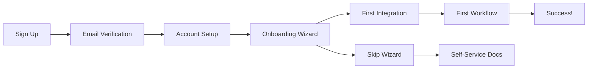

# PRD-005: Scale & Launch

**PRD Version:** 1.0.0  
**Created:** 2025-11-27  
**Owner:** Engineering Leadership  
**Status:** Active  
**Phase:** 5 of 5  
**Timeline:** Weeks 17-20

---

## 1. Overview

### 1.1 Purpose

This Product Requirements Document defines the specifications for FlashFusion's Scale & Launch phase - the final phase that transforms the platform from a development environment into a production-ready, scalable, and commercially viable product.

### 1.2 Background

With Core Platform (Phase 1), Agent Infrastructure (Phase 2), Business Automation (Phase 3), and Analytics (Phase 4) complete, Phase 5 focuses on:
- Production-grade scaling and reliability
- Security audit and compliance certification
- Customer onboarding and support infrastructure
- Documentation and training materials
- Beta launch with select customers

### 1.3 Goals

1. **Production Scaling:** Handle 10x expected load with auto-scaling
2. **Security & Compliance:** SOC 2 Type 1 ready, GDPR compliant
3. **Customer Onboarding:** 5+ beta customers live with <24h support SLA
4. **Documentation:** Complete user, API, and admin documentation
5. **Operational Excellence:** 99.9% uptime with comprehensive monitoring

### 1.4 Non-Goals (Out of Scope for Phase 5)

- Public GA launch (separate phase)
- Mobile applications (future roadmap)
- White-label product (enterprise phase)
- International expansion (growth phase)

---

## 2. Requirements

### 2.1 Functional Requirements

#### FR-001: Auto-Scaling Infrastructure

**Priority:** P0 (Critical)  
**Status:** ○ Planned

| ID | Requirement | Acceptance Criteria |
|----|-------------|---------------------|
| FR-001.1 | Horizontal Pod Autoscaling | All services scale 2-10x based on load |
| FR-001.2 | Cluster autoscaling | K8s nodes scale automatically |
| FR-001.3 | Database scaling | Read replicas, connection pooling |
| FR-001.4 | CDN configuration | Static assets served from edge |
| FR-001.5 | Load testing validation | Sustain 10x baseline load |

#### FR-002: Security & Compliance

**Priority:** P0 (Critical)  
**Status:** ○ Planned

| ID | Requirement | Acceptance Criteria |
|----|-------------|---------------------|
| FR-002.1 | SOC 2 Type 1 controls | All required controls implemented |
| FR-002.2 | GDPR compliance | Data protection measures in place |
| FR-002.3 | Penetration testing | Third-party pentest passed |
| FR-002.4 | Security audit | Internal audit completed |
| FR-002.5 | Incident response plan | Documented and tested |

#### FR-003: Production Deployment

**Priority:** P0 (Critical)  
**Status:** ○ Planned

| ID | Requirement | Acceptance Criteria |
|----|-------------|---------------------|
| FR-003.1 | Production K8s cluster | Multi-AZ, production-grade |
| FR-003.2 | Database production setup | HA PostgreSQL, automated backups |
| FR-003.3 | Secret management | HashiCorp Vault or AWS Secrets |
| FR-003.4 | Blue-green deployment | Zero-downtime deployments |
| FR-003.5 | Rollback capability | <5 minute rollback time |

#### FR-004: Documentation

**Priority:** P1 (High)  
**Status:** ○ Planned

| ID | Requirement | Acceptance Criteria |
|----|-------------|---------------------|
| FR-004.1 | User documentation | Complete feature documentation |
| FR-004.2 | API documentation | OpenAPI spec, examples, SDKs |
| FR-004.3 | Admin documentation | Operations, monitoring, troubleshooting |
| FR-004.4 | Developer documentation | Architecture, contribution guide |
| FR-004.5 | Training materials | Videos, tutorials, certification |

#### FR-005: Customer Onboarding

**Priority:** P0 (Critical)  
**Status:** ○ Planned

| ID | Requirement | Acceptance Criteria |
|----|-------------|---------------------|
| FR-005.1 | Self-service signup | Account creation, trial activation |
| FR-005.2 | Onboarding wizard | Guided first-time setup |
| FR-005.3 | Support ticketing | Help desk with <24h SLA |
| FR-005.4 | Customer success | Dedicated CSM for beta customers |
| FR-005.5 | Feedback collection | In-app feedback, NPS surveys |

### 2.2 Non-Functional Requirements

#### NFR-001: Availability

| ID | Requirement | Target | Measurement |
|----|-------------|--------|-------------|
| NFR-001.1 | System uptime | 99.9% | Monthly SLA |
| NFR-001.2 | Planned maintenance window | <4 hours/month | Scheduled |
| NFR-001.3 | Mean time to recovery | <15 minutes | Incident reports |
| NFR-001.4 | Recovery Point Objective | <1 hour | Backup testing |

#### NFR-002: Performance at Scale

| ID | Requirement | Target | Measurement |
|----|-------------|--------|-------------|
| NFR-002.1 | API response time | p95 <500ms | Load testing |
| NFR-002.2 | Dashboard load time | <3s | Real user monitoring |
| NFR-002.3 | Workflow throughput | 1000/hour | Stress testing |
| NFR-002.4 | Concurrent users | 500+ | Load testing |

#### NFR-003: Security

| ID | Requirement | Target | Measurement |
|----|-------------|--------|-------------|
| NFR-003.1 | Vulnerability scan | 0 critical/high | Weekly scans |
| NFR-003.2 | Encryption at rest | 100% | Audit |
| NFR-003.3 | Encryption in transit | 100% TLS | Certificate monitoring |
| NFR-003.4 | Access logging | 100% coverage | Audit log review |

---

## 3. Technical Design

### 3.1 Production Architecture

```
┌─────────────────────────────────────────────────────────────────────────────┐
│                           INTERNET                                          │
├─────────────────────────────────────────────────────────────────────────────┤
│                                                                             │
│  ┌──────────────┐  ┌──────────────┐  ┌──────────────┐                      │
│  │   CloudFlare │  │    AWS WAF   │  │   DDoS       │                      │
│  │     CDN      │  │   + Shield   │  │  Protection  │                      │
│  └──────┬───────┘  └──────┬───────┘  └──────┬───────┘                      │
│         │                 │                 │                              │
│         └─────────────────┴─────────────────┘                              │
│                           │                                                 │
└───────────────────────────┼─────────────────────────────────────────────────┘
                            │
                            ▼
┌─────────────────────────────────────────────────────────────────────────────┐
│                        LOAD BALANCER LAYER                                  │
├─────────────────────────────────────────────────────────────────────────────┤
│                                                                             │
│  ┌──────────────────────────────────────────────────────────────────────┐  │
│  │                     AWS ALB / GKE Ingress                            │  │
│  │                   (TLS termination, path routing)                    │  │
│  └──────────────────────────────────────────────────────────────────────┘  │
│                                                                             │
└─────────────────────────────────────────────────────────────────────────────┘
                            │
                            ▼
┌─────────────────────────────────────────────────────────────────────────────┐
│                       KUBERNETES CLUSTER (Multi-AZ)                         │
├─────────────────────────────────────────────────────────────────────────────┤
│                                                                             │
│  ┌─────────────────────────────────────────────────────────────────────┐   │
│  │  NAMESPACE: flashfusion-prod                                        │   │
│  │  ┌──────────────┐ ┌──────────────┐ ┌──────────────┐ ┌────────────┐ │   │
│  │  │   Web App    │ │   API GW     │ │  Dashboard   │ │  Webhook   │ │   │
│  │  │   (Next.js)  │ │  (Express)   │ │  (Next.js)   │ │  Receiver  │ │   │
│  │  │   2-10 pods  │ │   3-15 pods  │ │   2-8 pods   │ │  2-6 pods  │ │   │
│  │  └──────────────┘ └──────────────┘ └──────────────┘ └────────────┘ │   │
│  └─────────────────────────────────────────────────────────────────────┘   │
│                                                                             │
│  ┌─────────────────────────────────────────────────────────────────────┐   │
│  │  NAMESPACE: agents-prod                                             │   │
│  │  ┌───────────┐ ┌───────────┐ ┌───────────┐ ┌───────────┐ ┌───────┐ │   │
│  │  │Orchestratr│ │ Financial │ │  Support  │ │  Security │ │DevOps │ │   │
│  │  │ 2-8 pods  │ │ 2-6 pods  │ │ 2-6 pods  │ │ 2-4 pods  │ │2-4 pod│ │   │
│  │  └───────────┘ └───────────┘ └───────────┘ └───────────┘ └───────┘ │   │
│  └─────────────────────────────────────────────────────────────────────┘   │
│                                                                             │
│  ┌─────────────────────────────────────────────────────────────────────┐   │
│  │  NAMESPACE: workflows-prod                                          │   │
│  │  ┌──────────────────┐ ┌──────────────────┐ ┌──────────────────┐    │   │
│  │  │  Workflow Engine │ │   Event Bus      │ │    Scheduler     │    │   │
│  │  │     3-12 pods    │ │    3-9 pods      │ │     2-4 pods     │    │   │
│  │  └──────────────────┘ └──────────────────┘ └──────────────────┘    │   │
│  └─────────────────────────────────────────────────────────────────────┘   │
│                                                                             │
│  ┌─────────────────────────────────────────────────────────────────────┐   │
│  │  NAMESPACE: integrations-prod                                       │   │
│  │  ┌─────────┐ ┌─────────┐ ┌─────────┐ ┌─────────┐ ┌─────────┐       │   │
│  │  │ Stripe  │ │ GitHub  │ │ Notion  │ │ Slack   │ │SendGrid │       │   │
│  │  │  MCP    │ │  MCP    │ │  MCP    │ │  MCP    │ │  MCP    │       │   │
│  │  │ 2-6 pod │ │ 2-6 pod │ │ 2-4 pod │ │ 2-4 pod │ │ 2-4 pod │       │   │
│  │  └─────────┘ └─────────┘ └─────────┘ └─────────┘ └─────────┘       │   │
│  └─────────────────────────────────────────────────────────────────────┘   │
│                                                                             │
└─────────────────────────────────────────────────────────────────────────────┘
                            │
                            ▼
┌─────────────────────────────────────────────────────────────────────────────┐
│                        DATA LAYER (Multi-AZ)                                │
├─────────────────────────────────────────────────────────────────────────────┤
│                                                                             │
│  ┌──────────────────┐ ┌──────────────────┐ ┌──────────────────┐            │
│  │   PostgreSQL     │ │   Redis Cluster  │ │   TimescaleDB    │            │
│  │   (RDS Multi-AZ) │ │   (ElastiCache)  │ │   (EC2 + EBS)    │            │
│  │   Primary + Read │ │   3-node cluster │ │   HA setup       │            │
│  └──────────────────┘ └──────────────────┘ └──────────────────┘            │
│                                                                             │
│  ┌──────────────────┐ ┌──────────────────┐ ┌──────────────────┐            │
│  │      S3          │ │   Pinecone       │ │   Vault          │            │
│  │  (Object Store)  │ │  (Vector Store)  │ │  (Secrets)       │            │
│  └──────────────────┘ └──────────────────┘ └──────────────────┘            │
│                                                                             │
└─────────────────────────────────────────────────────────────────────────────┘
                            │
                            ▼
┌─────────────────────────────────────────────────────────────────────────────┐
│                        OBSERVABILITY LAYER                                  │
├─────────────────────────────────────────────────────────────────────────────┤
│                                                                             │
│  ┌──────────────────┐ ┌──────────────────┐ ┌──────────────────┐            │
│  │   Prometheus     │ │      Loki        │ │     Grafana      │            │
│  │   + Thanos       │ │   (Log Store)    │ │   (Dashboards)   │            │
│  └──────────────────┘ └──────────────────┘ └──────────────────┘            │
│                                                                             │
│  ┌──────────────────┐ ┌──────────────────┐ ┌──────────────────┐            │
│  │   AlertManager   │ │    PagerDuty     │ │     Sentry       │            │
│  │   (Alerting)     │ │   (Oncall)       │ │   (Errors)       │            │
│  └──────────────────┘ └──────────────────┘ └──────────────────┘            │
│                                                                             │
└─────────────────────────────────────────────────────────────────────────────┘
```

### 3.2 Scaling Configuration

```yaml
# k8s/production/hpa-configs.yaml

# API Gateway HPA
apiVersion: autoscaling/v2
kind: HorizontalPodAutoscaler
metadata:
  name: api-gateway-hpa
  namespace: flashfusion-prod
spec:
  scaleTargetRef:
    apiVersion: apps/v1
    kind: Deployment
    name: api-gateway
  minReplicas: 3
  maxReplicas: 15
  behavior:
    scaleUp:
      stabilizationWindowSeconds: 60
      policies:
        - type: Pods
          value: 4
          periodSeconds: 60
    scaleDown:
      stabilizationWindowSeconds: 300
      policies:
        - type: Percent
          value: 25
          periodSeconds: 120
  metrics:
    - type: Resource
      resource:
        name: cpu
        target:
          type: Utilization
          averageUtilization: 70
    - type: Resource
      resource:
        name: memory
        target:
          type: Utilization
          averageUtilization: 80
    - type: Pods
      pods:
        metric:
          name: http_requests_per_second
        target:
          type: AverageValue
          averageValue: "100"

---
# Workflow Engine HPA
apiVersion: autoscaling/v2
kind: HorizontalPodAutoscaler
metadata:
  name: workflow-engine-hpa
  namespace: workflows-prod
spec:
  scaleTargetRef:
    apiVersion: apps/v1
    kind: Deployment
    name: workflow-engine
  minReplicas: 3
  maxReplicas: 12
  metrics:
    - type: Resource
      resource:
        name: cpu
        target:
          type: Utilization
          averageUtilization: 65
    - type: Pods
      pods:
        metric:
          name: active_workflows
        target:
          type: AverageValue
          averageValue: "20"

---
# Cluster Autoscaler
apiVersion: autoscaling.k8s.io/v1
kind: ClusterAutoscaler
metadata:
  name: cluster-autoscaler
spec:
  scaleDown:
    enabled: true
    delayAfterAdd: 10m
    delayAfterDelete: 5m
    unneededTime: 10m
  resourceLimits:
    maxNodesTotal: 50
    cores:
      min: 10
      max: 500
    memory:
      min: 20Gi
      max: 2000Gi
```

### 3.3 Database High Availability

```yaml
# terraform/rds.tf
resource "aws_db_instance" "primary" {
  identifier           = "flashfusion-prod-primary"
  engine               = "postgres"
  engine_version       = "15.4"
  instance_class       = "db.r6g.xlarge"
  allocated_storage    = 500
  storage_type         = "gp3"
  storage_encrypted    = true
  kms_key_id           = aws_kms_key.database.arn
  
  multi_az             = true
  db_subnet_group_name = aws_db_subnet_group.prod.name
  vpc_security_group_ids = [aws_security_group.database.id]
  
  backup_retention_period = 30
  backup_window          = "03:00-04:00"
  maintenance_window     = "sun:04:00-sun:05:00"
  
  performance_insights_enabled = true
  monitoring_interval         = 15
  
  deletion_protection = true
  skip_final_snapshot = false
  
  tags = {
    Environment = "production"
    Service     = "flashfusion"
  }
}

resource "aws_db_instance" "read_replica" {
  count = 2
  
  identifier          = "flashfusion-prod-replica-${count.index + 1}"
  replicate_source_db = aws_db_instance.primary.id
  instance_class      = "db.r6g.large"
  
  vpc_security_group_ids = [aws_security_group.database.id]
  
  performance_insights_enabled = true
  monitoring_interval         = 15
}

resource "aws_elasticache_replication_group" "redis" {
  replication_group_id       = "flashfusion-prod-redis"
  description                = "Production Redis cluster"
  engine                     = "redis"
  engine_version             = "7.0"
  node_type                  = "cache.r6g.large"
  num_cache_clusters         = 3
  
  automatic_failover_enabled = true
  multi_az_enabled           = true
  
  at_rest_encryption_enabled = true
  transit_encryption_enabled = true
  
  snapshot_retention_limit   = 7
  snapshot_window            = "04:00-05:00"
  
  subnet_group_name          = aws_elasticache_subnet_group.prod.name
  security_group_ids         = [aws_security_group.redis.id]
}
```

### 3.4 Security Architecture

```
┌─────────────────────────────────────────────────────────────────────────────┐
│                           SECURITY LAYERS                                   │
├─────────────────────────────────────────────────────────────────────────────┤
│                                                                             │
│  LAYER 1: PERIMETER SECURITY                                               │
│  ┌─────────────────────────────────────────────────────────────────────┐   │
│  │  • AWS WAF with managed rules                                       │   │
│  │  • DDoS protection (AWS Shield)                                     │   │
│  │  • Rate limiting (CloudFlare)                                       │   │
│  │  • Bot detection and mitigation                                     │   │
│  └─────────────────────────────────────────────────────────────────────┘   │
│                                                                             │
│  LAYER 2: NETWORK SECURITY                                                 │
│  ┌─────────────────────────────────────────────────────────────────────┐   │
│  │  • VPC with private subnets                                         │   │
│  │  • Security groups (least privilege)                                │   │
│  │  • Network policies (deny by default)                               │   │
│  │  • TLS 1.3 for all traffic                                          │   │
│  └─────────────────────────────────────────────────────────────────────┘   │
│                                                                             │
│  LAYER 3: IDENTITY & ACCESS                                                │
│  ┌─────────────────────────────────────────────────────────────────────┐   │
│  │  • Supabase Auth (OAuth 2.0, OIDC)                                  │   │
│  │  • RBAC with fine-grained permissions                               │   │
│  │  • JWT with short expiry (15 min)                                   │   │
│  │  • Service-to-service mTLS                                          │   │
│  │  • API key rotation (90 days)                                       │   │
│  └─────────────────────────────────────────────────────────────────────┘   │
│                                                                             │
│  LAYER 4: APPLICATION SECURITY                                             │
│  ┌─────────────────────────────────────────────────────────────────────┐   │
│  │  • Input validation (Zod schemas)                                   │   │
│  │  • Output encoding (XSS prevention)                                 │   │
│  │  • SQL injection prevention (parameterized queries)                 │   │
│  │  • CSRF protection                                                  │   │
│  │  • Content Security Policy                                          │   │
│  └─────────────────────────────────────────────────────────────────────┘   │
│                                                                             │
│  LAYER 5: DATA SECURITY                                                    │
│  ┌─────────────────────────────────────────────────────────────────────┐   │
│  │  • Encryption at rest (AES-256)                                     │   │
│  │  • Encryption in transit (TLS 1.3)                                  │   │
│  │  • PII masking in logs                                              │   │
│  │  • Data retention policies                                          │   │
│  │  • GDPR right to erasure                                            │   │
│  └─────────────────────────────────────────────────────────────────────┘   │
│                                                                             │
│  LAYER 6: SECRETS MANAGEMENT                                               │
│  ┌─────────────────────────────────────────────────────────────────────┐   │
│  │  • HashiCorp Vault for secrets                                      │   │
│  │  • AWS KMS for encryption keys                                      │   │
│  │  • Secret rotation automation                                       │   │
│  │  • Audit logging for all access                                     │   │
│  └─────────────────────────────────────────────────────────────────────┘   │
│                                                                             │
│  LAYER 7: MONITORING & RESPONSE                                            │
│  ┌─────────────────────────────────────────────────────────────────────┐   │
│  │  • Security event monitoring                                        │   │
│  │  • Anomaly detection                                                │   │
│  │  • Automated incident response                                      │   │
│  │  • 24/7 security alerting                                           │   │
│  └─────────────────────────────────────────────────────────────────────┘   │
│                                                                             │
└─────────────────────────────────────────────────────────────────────────────┘
```

### 3.5 SOC 2 Control Mapping

| Control Area | Requirement | Implementation |
|--------------|-------------|----------------|
| CC1 - Control Environment | Organizational commitment to integrity | Code of conduct, security policy |
| CC2 - Communication | Information quality | Documentation, incident reports |
| CC3 - Risk Assessment | Risk identification | Security audits, threat modeling |
| CC4 - Monitoring | Ongoing control monitoring | Prometheus, alerting, reviews |
| CC5 - Control Activities | Policies and procedures | RBAC, encryption, logging |
| CC6 - Logical Access | Access controls | MFA, SSO, least privilege |
| CC7 - System Operations | Infrastructure security | Hardening, patching, DR |
| CC8 - Change Management | Change control process | GitOps, code review, CI/CD |
| CC9 - Risk Mitigation | Vendor management | Third-party assessments |

---

## 4. Compliance & Security

### 4.1 SOC 2 Type 1 Readiness Checklist

#### Control Environment

- [ ] Security policy documented and approved
- [ ] Acceptable use policy in place
- [ ] Security awareness training for all staff
- [ ] Background checks for new hires
- [ ] Annual security policy review

#### Risk Assessment

- [ ] Risk assessment performed
- [ ] Risk register maintained
- [ ] Threat modeling completed
- [ ] Penetration test performed
- [ ] Vulnerability management process

#### Monitoring Activities

- [ ] Security monitoring 24/7
- [ ] Log retention (90+ days)
- [ ] Alert thresholds configured
- [ ] Monthly security reviews
- [ ] Incident response tested

#### Logical Access

- [ ] MFA enforced for all users
- [ ] Password policy (12+ chars, complexity)
- [ ] Access reviews quarterly
- [ ] Terminated user access revoked within 24h
- [ ] Privileged access monitoring

#### Change Management

- [ ] Change management process documented
- [ ] All changes tracked in version control
- [ ] Code review required for all changes
- [ ] Automated testing before deployment
- [ ] Rollback procedures tested

### 4.2 GDPR Compliance Checklist

- [ ] Privacy policy published
- [ ] Cookie consent mechanism
- [ ] Data processing agreements with vendors
- [ ] Data inventory maintained
- [ ] Lawful basis for processing documented
- [ ] Subject access request process
- [ ] Data breach notification process (<72 hours)
- [ ] Data retention policies enforced
- [ ] Right to erasure implemented
- [ ] Data portability supported
- [ ] Privacy impact assessments for new features

### 4.3 Penetration Testing Scope

```yaml
# pentest-scope.yaml
scope:
  in_scope:
    - Web application (app.flashfusion.co)
    - API endpoints (api.flashfusion.co)
    - Authentication flows
    - Authorization controls
    - Data storage and encryption
    - Third-party integrations
    - Mobile API (if applicable)
  
  out_of_scope:
    - Third-party SaaS (Stripe, Supabase)
    - Physical security
    - Social engineering
    - DoS testing (separate arrangement)
  
  testing_types:
    - OWASP Top 10 vulnerability assessment
    - Authentication bypass attempts
    - Authorization bypass attempts
    - Injection attacks (SQL, XSS, etc.)
    - Business logic testing
    - API security testing
    - Session management testing
  
  timeline:
    start_date: "2026-02-01"
    duration: "5 business days"
    retesting: "3 business days after remediation"
  
  deliverables:
    - Executive summary
    - Technical findings report
    - Remediation recommendations
    - Retesting confirmation
```

---

## 5. Documentation Plan

### 5.1 Documentation Structure

```
docs/
├── user/                           # End-user documentation
│   ├── getting-started/            # Onboarding guides
│   │   ├── quick-start.md
│   │   ├── first-workflow.md
│   │   └── integrations-setup.md
│   ├── features/                   # Feature documentation
│   │   ├── workflows/
│   │   ├── agents/
│   │   ├── analytics/
│   │   └── integrations/
│   ├── tutorials/                  # Step-by-step tutorials
│   │   ├── customer-onboarding.md
│   │   ├── sales-automation.md
│   │   └── custom-workflows.md
│   └── troubleshooting/            # Common issues
│       ├── common-errors.md
│       └── faq.md
│
├── api/                            # API documentation
│   ├── overview.md
│   ├── authentication.md
│   ├── endpoints/
│   │   ├── workflows.md
│   │   ├── agents.md
│   │   ├── analytics.md
│   │   └── webhooks.md
│   ├── sdks/
│   │   ├── javascript.md
│   │   ├── python.md
│   │   └── go.md
│   └── openapi/
│       └── flashfusion-api.yaml
│
├── admin/                          # Administrator documentation
│   ├── deployment/
│   │   ├── kubernetes.md
│   │   ├── docker.md
│   │   └── cloud-providers.md
│   ├── operations/
│   │   ├── monitoring.md
│   │   ├── scaling.md
│   │   ├── backup-restore.md
│   │   └── disaster-recovery.md
│   ├── security/
│   │   ├── hardening.md
│   │   ├── access-control.md
│   │   └── audit-logging.md
│   └── maintenance/
│       ├── upgrades.md
│       └── troubleshooting.md
│
└── developer/                      # Developer documentation
    ├── architecture/
    │   ├── overview.md
    │   ├── agents.md
    │   ├── workflows.md
    │   └── data-flow.md
    ├── contributing/
    │   ├── code-style.md
    │   ├── pull-requests.md
    │   └── testing.md
    ├── extending/
    │   ├── custom-agents.md
    │   ├── custom-workflows.md
    │   └── custom-integrations.md
    └── reference/
        ├── agent-sdk.md
        ├── workflow-schema.md
        └── mcp-protocol.md
```

### 5.2 Training Materials

```yaml
training:
  videos:
    - title: "FlashFusion Platform Overview"
      duration: "15 min"
      audience: "All users"
      
    - title: "Creating Your First Workflow"
      duration: "20 min"
      audience: "Business users"
      
    - title: "Agent Development Deep Dive"
      duration: "45 min"
      audience: "Developers"
      
    - title: "Operations and Monitoring"
      duration: "30 min"
      audience: "Administrators"
      
    - title: "Security Best Practices"
      duration: "20 min"
      audience: "All users"
  
  workshops:
    - name: "Workflow Builder Workshop"
      duration: "2 hours"
      format: "Interactive live session"
      capacity: 20
      
    - name: "Agent Development Bootcamp"
      duration: "4 hours"
      format: "Hands-on coding"
      capacity: 15
      
    - name: "Administrator Training"
      duration: "3 hours"
      format: "Demo + Q&A"
      capacity: 10
  
  certification:
    - name: "FlashFusion Certified User"
      requirements:
        - Complete onboarding modules
        - Pass knowledge assessment (80%)
        - Build 3 workflows
        
    - name: "FlashFusion Certified Developer"
      requirements:
        - Complete developer modules
        - Pass technical assessment (75%)
        - Build and deploy custom agent
        
    - name: "FlashFusion Certified Administrator"
      requirements:
        - Complete admin modules
        - Pass operations assessment (80%)
        - Complete DR drill successfully
```

---

## 6. Customer Onboarding

### 6.1 Onboarding Flow



### 6.2 Onboarding Wizard Screens

```typescript
interface OnboardingStep {
  id: string;
  title: string;
  description: string;
  component: React.FC;
  isComplete: () => boolean;
  canSkip: boolean;
}

const onboardingSteps: OnboardingStep[] = [
  {
    id: 'welcome',
    title: 'Welcome to FlashFusion',
    description: 'Let us help you get started',
    component: WelcomeScreen,
    isComplete: () => true,
    canSkip: false,
  },
  {
    id: 'company-profile',
    title: 'Company Profile',
    description: 'Tell us about your business',
    component: CompanyProfileForm,
    isComplete: () => !!user.company.name,
    canSkip: true,
  },
  {
    id: 'first-integration',
    title: 'Connect Your First Integration',
    description: 'Connect to Stripe, GitHub, or Notion',
    component: IntegrationSelector,
    isComplete: () => integrations.length > 0,
    canSkip: true,
  },
  {
    id: 'first-workflow',
    title: 'Create Your First Workflow',
    description: 'Choose from templates or start from scratch',
    component: WorkflowTemplateSelector,
    isComplete: () => workflows.length > 0,
    canSkip: true,
  },
  {
    id: 'invite-team',
    title: 'Invite Your Team',
    description: 'Add team members to collaborate',
    component: TeamInviteForm,
    isComplete: () => teamMembers.length > 1,
    canSkip: true,
  },
  {
    id: 'complete',
    title: "You're All Set!",
    description: 'Start automating your business',
    component: OnboardingComplete,
    isComplete: () => true,
    canSkip: false,
  },
];
```

### 6.3 Support Infrastructure

```yaml
support:
  channels:
    - type: Help Center
      url: help.flashfusion.co
      availability: 24/7 self-service
      
    - type: Live Chat
      tool: Intercom
      availability: Business hours (9-5 PT)
      response_time: <5 min
      
    - type: Email Support
      address: support@flashfusion.co
      sla: <24 hours
      
    - type: Dedicated Slack
      audience: Beta customers only
      response_time: <4 hours
  
  escalation_tiers:
    tier_1:
      name: Customer Support
      handle: Common issues, how-to questions
      sla: <24 hours
      
    tier_2:
      name: Technical Support
      handle: Technical issues, integrations
      sla: <8 hours
      
    tier_3:
      name: Engineering
      handle: Bugs, system issues
      sla: <4 hours
      
    critical:
      name: On-Call Engineering
      handle: Production incidents
      sla: <30 min
      pager: PagerDuty
  
  metrics:
    - metric: First Response Time
      target: <4 hours
      
    - metric: Resolution Time
      target: <24 hours
      
    - metric: Customer Satisfaction (CSAT)
      target: >90%
      
    - metric: Net Promoter Score (NPS)
      target: >50
```

---

## 7. User Stories

### 7.1 Platform Admin Stories

#### US-001: Scale Infrastructure

**As a** platform administrator  
**I want to** have infrastructure that scales automatically  
**So that** the system handles traffic spikes without manual intervention

**Acceptance Criteria:**
- [ ] HPA scales pods based on CPU/memory
- [ ] Cluster autoscaler adds nodes when needed
- [ ] Database read replicas handle read traffic
- [ ] No manual intervention needed for 10x load

#### US-002: Monitor System Health

**As a** platform administrator  
**I want to** have comprehensive monitoring and alerting  
**So that** I can identify and resolve issues quickly

**Acceptance Criteria:**
- [ ] Grafana dashboards for all services
- [ ] PagerDuty alerts for critical issues
- [ ] SLA tracking and reporting
- [ ] Runbooks for common issues

### 7.2 Security Team Stories

#### US-003: Security Compliance

**As a** security officer  
**I want to** demonstrate compliance with SOC 2  
**So that** customers can trust our security practices

**Acceptance Criteria:**
- [ ] All SOC 2 controls documented
- [ ] Evidence collection automated
- [ ] Third-party audit completed
- [ ] Compliance report available

#### US-004: Incident Response

**As a** security officer  
**I want to** have a tested incident response plan  
**So that** we can respond quickly to security incidents

**Acceptance Criteria:**
- [ ] Incident response plan documented
- [ ] Team trained on procedures
- [ ] Tabletop exercise completed
- [ ] Post-incident review process

### 7.3 Customer Stories

#### US-005: Self-Service Onboarding

**As a** new customer  
**I want to** set up my account without manual assistance  
**So that** I can start using the product immediately

**Acceptance Criteria:**
- [ ] Sign up flow works end-to-end
- [ ] Onboarding wizard guides setup
- [ ] First workflow runs successfully
- [ ] Support chat available if needed

#### US-006: Get Help

**As a** customer  
**I want to** find answers to my questions easily  
**So that** I can resolve issues without waiting for support

**Acceptance Criteria:**
- [ ] Help center searchable
- [ ] Documentation covers common use cases
- [ ] Video tutorials available
- [ ] Live chat for urgent issues

---

## 8. Testing Strategy

### 8.1 Load Testing

```javascript
// load-tests/baseline.js
import http from 'k6/http';
import { check, sleep } from 'k6';

export const options = {
  stages: [
    { duration: '5m', target: 100 },   // Ramp up to 100 users
    { duration: '10m', target: 100 },  // Stay at 100 users
    { duration: '5m', target: 500 },   // Ramp up to 500 users
    { duration: '10m', target: 500 },  // Stay at 500 users
    { duration: '5m', target: 1000 },  // Ramp up to 1000 users
    { duration: '10m', target: 1000 }, // Stay at 1000 users
    { duration: '5m', target: 0 },     // Ramp down
  ],
  thresholds: {
    http_req_duration: ['p(95)<500'],  // 95% of requests under 500ms
    http_req_failed: ['rate<0.01'],    // Error rate under 1%
  },
};

const BASE_URL = __ENV.BASE_URL || 'https://api.flashfusion.co';

export default function () {
  // API health check
  const healthRes = http.get(`${BASE_URL}/health`);
  check(healthRes, {
    'health check status is 200': (r) => r.status === 200,
  });

  // List workflows
  const workflowsRes = http.get(`${BASE_URL}/api/workflows`, {
    headers: { Authorization: `Bearer ${__ENV.API_TOKEN}` },
  });
  check(workflowsRes, {
    'workflows status is 200': (r) => r.status === 200,
    'workflows response time < 500ms': (r) => r.timings.duration < 500,
  });

  // Create workflow execution
  const execRes = http.post(
    `${BASE_URL}/api/workflows/customer-onboarding/execute`,
    JSON.stringify({
      inputs: {
        lead: {
          email: `test-${Date.now()}@example.com`,
          name: 'Load Test User',
          company: 'Test Company',
        },
      },
    }),
    {
      headers: {
        'Content-Type': 'application/json',
        Authorization: `Bearer ${__ENV.API_TOKEN}`,
      },
    }
  );
  check(execRes, {
    'execution status is 202': (r) => r.status === 202,
    'execution response time < 1s': (r) => r.timings.duration < 1000,
  });

  sleep(1);
}
```

### 8.2 Chaos Engineering

```yaml
# chaos-tests/pod-failure.yaml
apiVersion: chaos-mesh.org/v1alpha1
kind: PodChaos
metadata:
  name: pod-failure-test
  namespace: chaos-testing
spec:
  action: pod-failure
  mode: one
  selector:
    namespaces:
      - flashfusion-prod
    labelSelectors:
      app: api-gateway
  duration: '5m'
  scheduler:
    cron: '@weekly'

---
# chaos-tests/network-latency.yaml
apiVersion: chaos-mesh.org/v1alpha1
kind: NetworkChaos
metadata:
  name: network-latency-test
spec:
  action: delay
  mode: all
  selector:
    namespaces:
      - agents-prod
  delay:
    latency: '200ms'
    correlation: '50'
    jitter: '50ms'
  duration: '10m'

---
# chaos-tests/redis-failure.yaml
apiVersion: chaos-mesh.org/v1alpha1
kind: PodChaos
metadata:
  name: redis-failure-test
spec:
  action: pod-kill
  mode: one
  selector:
    namespaces:
      - data-prod
    labelSelectors:
      app: redis
  duration: '2m'
```

### 8.3 Disaster Recovery Testing

```yaml
# dr-tests/dr-drill-checklist.yaml
drill:
  name: "Q1 2026 DR Drill"
  date: "2026-02-15"
  duration: "4 hours"
  
  scenarios:
    - name: "Database Failover"
      objective: "Verify RDS Multi-AZ failover"
      steps:
        - Trigger RDS failover via AWS Console
        - Monitor application behavior
        - Verify no data loss
        - Measure recovery time
      success_criteria:
        - Failover completes in <5 minutes
        - Zero data loss
        - No manual intervention required
      
    - name: "Kubernetes Node Failure"
      objective: "Verify pod rescheduling"
      steps:
        - Cordon and drain a worker node
        - Monitor pod rescheduling
        - Verify service availability
        - Uncordon node
      success_criteria:
        - Pods rescheduled in <2 minutes
        - No service interruption
      
    - name: "Region Failover"
      objective: "Verify multi-region DR"
      steps:
        - Simulate primary region failure
        - Update DNS to DR region
        - Verify service in DR region
        - Verify data consistency
      success_criteria:
        - Failover completes in <30 minutes
        - RPO <1 hour
        - All critical services available
  
  rollback:
    - Restore original DNS
    - Verify primary region services
    - Document lessons learned
  
  reporting:
    - DR drill report
    - Time to recovery measurements
    - Issues encountered
    - Improvement recommendations
```

---

## 9. Rollout Plan

### 9.1 Week 17: Infrastructure Scaling

- [ ] Deploy production K8s cluster
- [ ] Configure HPA for all services
- [ ] Set up cluster autoscaler
- [ ] Configure database HA
- [ ] Run baseline load tests

### 9.2 Week 18: Security & Compliance

- [ ] Complete security hardening
- [ ] Run penetration test
- [ ] Complete SOC 2 evidence collection
- [ ] Submit for SOC 2 Type 1 audit
- [ ] Finalize GDPR compliance

### 9.3 Week 19: Documentation & Training

- [ ] Complete user documentation
- [ ] Complete API documentation
- [ ] Create training videos
- [ ] Set up help center
- [ ] Train support team

### 9.4 Week 20: Beta Launch

- [ ] Onboard beta customers
- [ ] Monitor system performance
- [ ] Collect feedback
- [ ] Address critical issues
- [ ] Celebrate launch! 🎉

---

## 10. Success Criteria

### 10.1 Definition of Done

- [ ] 99.9% uptime achieved
- [ ] SOC 2 Type 1 audit completed
- [ ] 5+ beta customers live
- [ ] Support SLA met (<24h response)
- [ ] NPS score >50
- [ ] Zero critical security issues

### 10.2 Acceptance Metrics

| Metric | Target | Actual | Status |
|--------|--------|--------|--------|
| System uptime | 99.9% | TBD | ○ |
| API p95 latency | <500ms | TBD | ○ |
| Beta customers | 5+ | TBD | ○ |
| Support SLA | <24h | TBD | ○ |
| NPS score | >50 | TBD | ○ |
| Security issues | 0 critical | TBD | ○ |

---

## 11. Appendix

### 11.1 Glossary

| Term | Definition |
|------|------------|
| SOC 2 | Service Organization Control 2 compliance |
| HPA | Horizontal Pod Autoscaler |
| RTO | Recovery Time Objective |
| RPO | Recovery Point Objective |
| DR | Disaster Recovery |
| NPS | Net Promoter Score |

### 11.2 References

- [SOC 2 Compliance Guide](https://www.aicpa.org)
- [GDPR Official Text](https://gdpr.eu)
- [Kubernetes HPA](https://kubernetes.io/docs/tasks/run-application/horizontal-pod-autoscale/)
- [AWS Well-Architected](https://aws.amazon.com/architecture/well-architected/)

### 11.3 Revision History

| Version | Date | Author | Changes |
|---------|------|--------|---------|
| 1.0.0 | 2025-11-27 | Engineering Leadership | Initial PRD |

---

**Document Owner:** Engineering Leadership  
**Next Review:** 2026-02-05  
**Approval Status:** Pending
